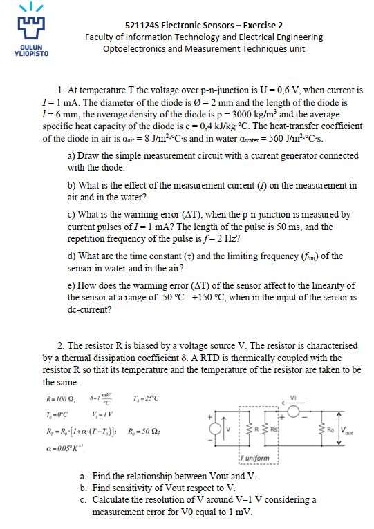
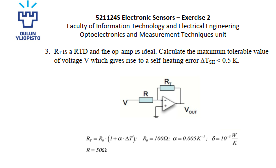

# 521124S Electronic Sensors ( Exercise 2 Solutions ) 
**Student:** Muhammad Zaeem Sarfraz  
**University:** University of Oulu  
**Course:** 521124S Electronic Sensors  
**Student No:** x8435325 (Uvaasa)
**Email:** msarfraz24@student.oulu.fi 

---

---

---

## 1. p–n junction thermometer

Given:

- U = 0.6 V at I = 1 mA → P = 0.6 mW
- d = 2 mm, l = 6 mm, ρ = 3000 kg/m³, c = 0.4 kJ/kg·°C
- α_air = 8 W/m²K, α_water = 560 W/m²K

Treat the diode as a small cylinder, uniform temperature, cooled by convection.

Volume:
$$V = \pi (d/2)^2 l = \pi (1\times10^{-3})^2 (6\times10^{-3}) \approx 1.9\times10^{-8}\,\text{m}^3$$

Surface area:
$$A = \pi d l + 2\pi (d/2)^2 \approx 4.4\times10^{-5}\,\text{m}^2$$

Mass and heat capacity:
$$m = \rho V \approx 5.7\times10^{-5}\,\text{kg}, \qquad C = mc \approx 2.3\times10^{-2}\,\text{J/K}$$

Self‑heating (steady):
$$\Delta T_{ss} = \frac{P}{hA}$$

- air:  $\Delta T_{ss,air} \approx 1.7\,\text{K}$
- water: $\Delta T_{ss,water} \approx 0.024\,\text{K}$

### 1(a) Circuit

Current source (1 mA) → diode → return. Voltage across diode measured with a voltmeter.

### 1(b) Effect of I

Because of self‑heating, constant 1 mA causes about **1.7 K** error in air and only **0.02 K** in water (much smaller because h is larger).

### 1(c) Pulsed current (1 mA, 50 ms, 2 Hz)

Time constants:
$$\tau = \frac{C}{hA}$$

- air:  $\tau_{air} \approx 64\,\text{s}$
- water: $\tau_{water} \approx 0.92\,\text{s}$

Pulsed power, first‑order system. Using the usual ON/OFF exponential formulas for a thermal RC, the peak rises in the periodic state are roughly

- $\Delta T_{peak,air} \approx 0.17\,\text{K}$
- $\Delta T_{peak,water} \approx 0.003\,\text{K}$

So pulsed measurement reduces the error a lot compared to DC.

### 1(d) Time constant and limiting frequency

Using $f_{lim} \approx 1/(2\pi\tau)$:

- air:  $f_{lim,air} \approx 2.5\times10^{-3}\,\text{Hz}$
- water: $f_{lim,water} \approx 0.17\,\text{Hz}$

The sensor is much faster in water.

### 1(e) Linearity

With DC current the diode is always a bit warmer than the medium by about $\Delta T_{ss}$. Over −50…+150 °C this offset is almost constant, so it mainly shifts the characteristic up (offset error). Linearity is only slightly affected.

---

## 2. Resistor R with thermally coupled RTD

Given (from the figure):

- R = 100 Ω, δ = 1 mW/°C = $10^{-3}$ W/K
- $T_a = 25^\circ$C, $T_0 = 0^\circ$C
- $R_0 = 50\,Ω$, $\alpha = 0.005\,\text{K}^{-1}$
- RTD model: $R_T = R_0[1 + \alpha (T - T_0)]$

Heating of R:
$$P = \frac{V^2}{R}, \qquad \Delta T = \frac{P}{\delta} = \frac{V^2}{R\delta}$$

Temperature at RTD:
$$T = T_a + \Delta T$$

So
$$R_T = R_0\Bigl[1 + \alpha\Bigl(T_a - T_0 + \frac{V^2}{R\delta}\Bigr)\Bigr]$$

The RTD and $R_0$ form a divider excited by $V_i$, output across $R_0$:

$$V_{out} = V_i\frac{R_0}{R_T + R_0}$$

### 2(a) Relation between $V_{out}$ and V

Insert $R_T$ and simplify by factoring $R_0$:

$$V_{out}(V) = \frac{V_i}{2 + \alpha\Bigl(T_a - T_0 + \dfrac{V^2}{R\delta}\Bigr)}$$

### 2(b) Sensitivity $dV_{out}/dV$

Let 
$$X(V) = 2 + \alpha\Bigl(T_a - T_0 + \frac{V^2}{R\delta}\Bigr)$$
Then $V_{out} = V_i X^{-1}$ and

$$\frac{dV_{out}}{dV} = -V_i\,\alpha\,\frac{2V}{R\delta}\,\frac{1}{X^2}$$

### 2(c) Resolution around V = 1 V

At V = 1 V:

$$\Delta T = \frac{1}{100\times0.001} = 10^\circ\text{C}$$
$$R_T = 50[1 + 0.005(25 + 10)] = 58.75\,Ω$$

Using the divider form and chain rule gives numerically

$$\left|\frac{dV_{out}}{dV}\right|_{V=1\,\text{V}} \approx 0.021\,\text{V/V}$$

For a measurement error $\Delta V_{out} = 1$ mV, the smallest detectable change of V is

$$\Delta V \approx \frac{0.001}{0.021} \approx 0.047\,\text{V}$$

---

## 3. RTD self‑heating limit with op‑amp

Given:

- RTD: $R_T \approx 100\,Ω$, $R = 50\,Ω$
- $\alpha = 0.005\,\text{K}^{-1}$, $\delta = 10^{-3}$ W/K
- Allowed self‑heating: $\Delta T_{SH} < 0.5$ K

Current in the series branch: $I = V/(R + R_T)$.

Power in RTD:
$$P_{RT} = I^2 R_T = \frac{V^2 R_T}{(R + R_T)^2}$$

Self‑heating:
$$\Delta T_{SH} = \frac{P_{RT}}{\delta}$$

Approximate with $R_T = 100\,Ω$, $R+R_T = 150\,Ω$:

$$\Delta T_{SH} \approx \frac{V^2\cdot100}{150^2\cdot10^{-3}} \approx 4.44 V^2$$

Condition $\Delta T_{SH} < 0.5$ K:

$$4.44 V^2 < 0.5 \Rightarrow V^2 < 0.11 \Rightarrow V_{max} \approx 0.34\,\text{V}$$

---

### Formulas used

- Thermal model: $C\,d\Delta T/dt + hA\Delta T = P$ → $\tau = C/(hA)$, $\Delta T_{ss} = P/(hA)$ (temperature‑sensor lecture).
- RTD: $R_T = R_0[1 + \alpha (T - T_0)]$ and simple voltage divider.
- Heating: $P = V^2/R$, self‑heating via $\Delta T = P/\delta$.
